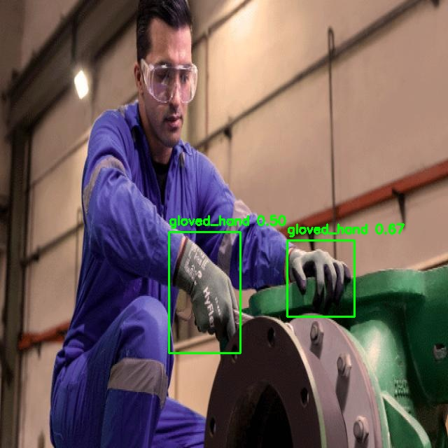
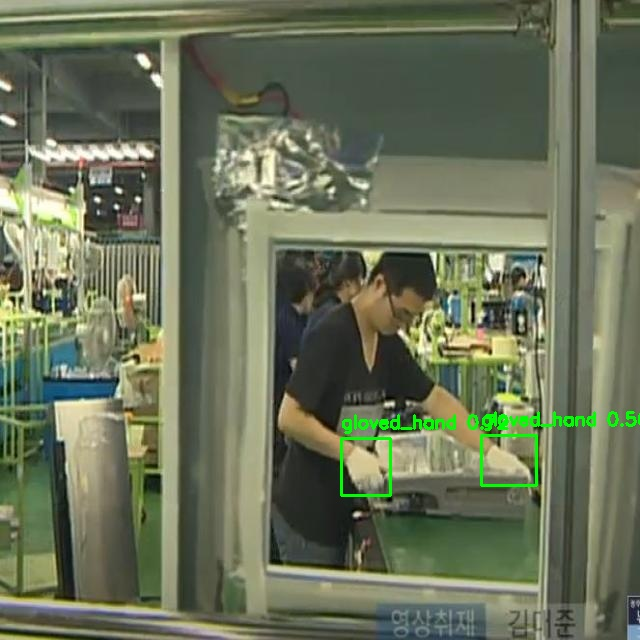
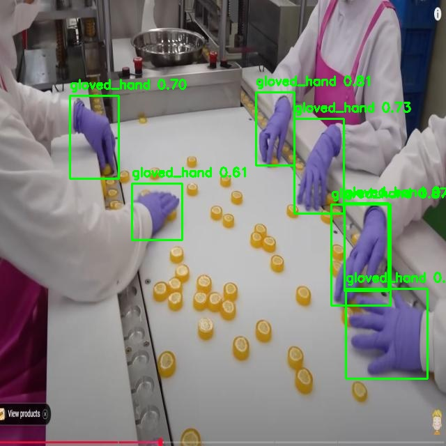
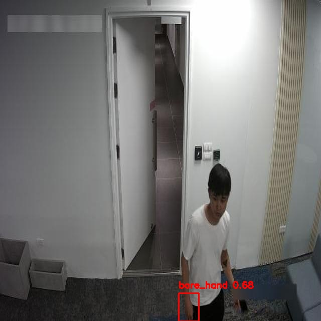
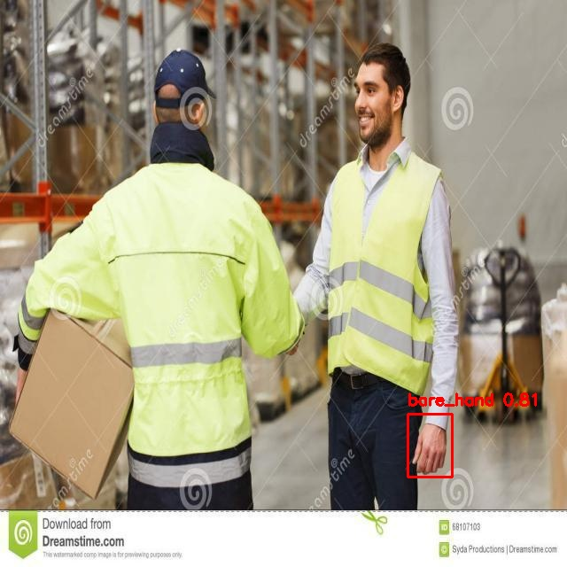
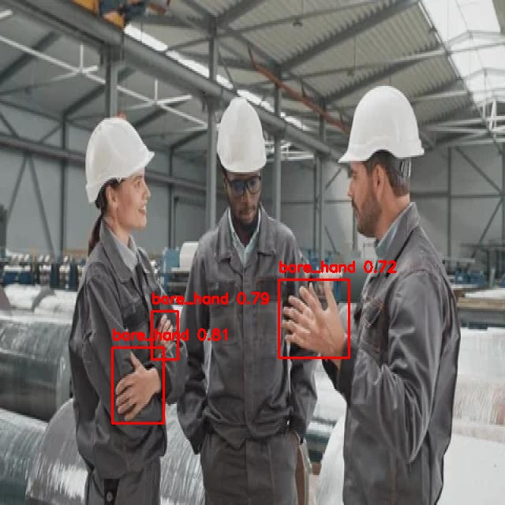
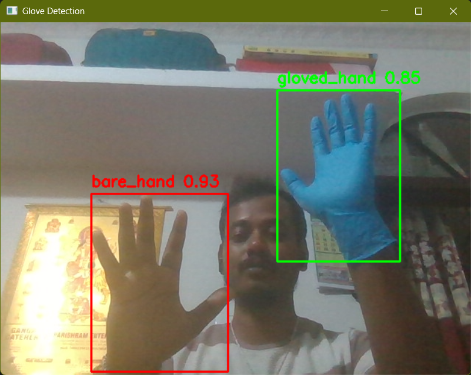

# 🧤 Glove Detection using YOLOv8

A deep learning project to detect whether a hand is **gloved** 🧤 or **bare** ✋ using **YOLOv8 (Ultralytics)**.
This project demonstrates **end-to-end object detection** — from dataset preparation and training on Google Colab, to evaluation and real-time inference using webcam in VS Code.

---
## 📂 Project Structure

```
Gloves_Detection_Model/
├── .venv/                 # Virtual environment (ignored in git)
├── input/                 # Input images/videos
├── output/                # Detection results
├── logs/                  # Training logs
├── notebooks/             # Jupyter/Colab notebooks (training, evaluation)
├── best_glove_model.pt    # Trained YOLOv8 model weights
├── data.yaml              # Dataset configuration
├── detection_script.py    # Script for inference on images/videos
├── webcam_test.py         # Real-time webcam detection
├── requirements.txt       # Project dependencies
├── .gitignore             # Ignored files/folders
├── image.png              # Example detection output
└── README.md              # Project documentation
```
Perfect idea 👍 Adding a **Data Overview** section will make your README look more complete and professional.

Here’s how you can structure it (based on the Roboflow documentation you shared):

---

### 📊 Data Overview

This project uses the **Glove Dataset (v8)** provided via [Roboflow Universe](https://universe.roboflow.com/test-el83b/glove-absoo).

* **Total Images**: 5000+
* **Format**: YOLOv8 (segmentation-style annotations)
* **Classes**:

  * `gloved_hand`
  * `bare_hand`
* **Pre-processing Applied**:

  * Auto-orientation of pixel data (with EXIF-orientation stripping)
  * Resized to 640x640 (stretch)
* **Augmentation**: None applied in dataset export
* **License**: MIT

🔗 [View Dataset on Roboflow](https://universe.roboflow.com/test-el83b/glove-absoo)


---

## ⚡ Features

* ✅ **YOLOv8s** model trained on a custom dataset of hands (gloved/bare).
* ✅ **Google Colab + Free GPU** used for training.
* ✅ **Data Augmentation** and **Hyperparameter Tuning** for better performance.
* ✅ Achieved strong performance on validation set:

  * Precision: **0.88**
  * Recall: **0.74**
  * mAP\@50: **0.83**
* ✅ Supports **real-time webcam detection** (via OpenCV).
* ✅ Clean repo with reproducible notebooks and scripts.

---
## Screenshots






### Webcam


---
## 📊 Model Performance

* **Gloved Hand**

  * Correct detections: 593
  * Misclassified as bare: 3
  * Missed: 96

* **Bare Hand**

  * Correct detections: 542
  * Misclassified as gloved: 1
  * Missed: 109

* **Background**

  * Misclassified as gloved: 150
  * Misclassified as bare: 178

⚖️ **Strengths**: High precision, works well in most scenarios.

⚠️ **Drawbacks**: Background misclassifications still occur in some cases.

---

## 🚀 Quick Start

### 1️⃣ Clone the repo

```bash
git clone https://github.com/yourusername/Gloves_Detection_Model.git
cd Gloves_Detection_Model
```

### 2️⃣ Install dependencies

```bash
pip install -r requirements.txt
```

### 3️⃣ Run detection on image/video

```bash
python detection_script.py --source input/image.png
```

### 4️⃣ Real-time webcam test

```bash
python webcam_test.py
```

---

## 🧑‍💻 Notebooks

* `notebooks/Glove_Detection_Training.ipynb` → End-to-end training in Colab
* `notebooks/Model_Evaluation.ipynb` → Performance metrics & visualization

⚠️ Note: Some cells (e.g., `!pip install`, `google.colab`) are **Colab-specific** and may show warnings in VS Code.

---

## 📈 Achievements

* Built a **custom YOLOv8 object detection model** from scratch.
* Successfully trained & evaluated on **\~6k images**.
* Integrated **real-time webcam inference**.
* Achieved **strong performance (mAP\@50 = 0.83)** on validation set.

---

## ⚠️ Limitations

* Background clutter sometimes misclassified as hand.
* Performance could be improved with **more training data** and **longer training epochs**.
* Currently optimized for Colab training; may need adjustments for local GPU setups.

---
## 🏭 Real-World Applications

This glove detection system can be applied in **manufacturing, production, and safety-critical environments**:

* 🏗 **Workplace Safety** → Ensures workers wear gloves when handling machinery or hazardous materials.
* 🧪 **Healthcare & Labs** → Detects compliance with protective gear policies.
* 🚗 **Automobile & Heavy Industry** → Prevents accidents by monitoring PPE (Personal Protective Equipment) usage.
* 📷 **Smart Surveillance** → Automated monitoring in real-time via CCTV or embedded systems.

Beyond safety, the system can contribute to **compliance monitoring, reducing workplace accidents, and improving overall operational efficiency**.

---

## 🔮 Future Work

* Train with **YOLOv8m/l** models for higher accuracy.
* Improve dataset diversity (lighting, background, skin tones, glove types).
* Deploy as a **web app** (Streamlit / FastAPI).
* Explore **segmentation** for better hand-glove boundary detection.

---

## 🙌 Acknowledgements

* [Ultralytics YOLOv8](https://github.com/ultralytics/ultralytics)
* Google Colab Free GPU
* OpenCV for real-time inference

---